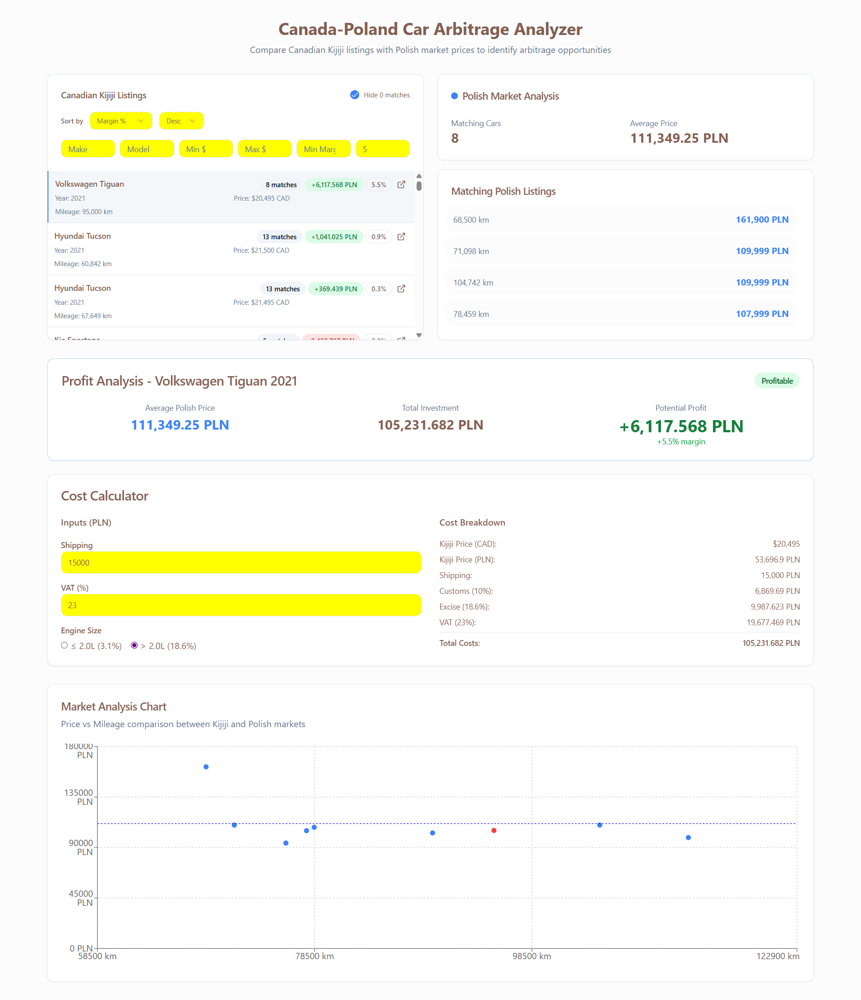

# 🚗 Car Arbitrage Finder

This project is a **car arbitrage analysis tool** that helps identify profitable opportunities when buying used cars in **Quebec (Canada)** and selling them in **Poland**.

It automates the process by:

1. Scraping used car listings from Polish and Quebec marketplaces.
2. Transforming raw scraped data into clean, comparable datasets.
3. Storing the results in a local **SQLite database**.
4. Serving data through a **Node.js API**.
5. Displaying an **interactive web dashboard** that lets users filter listings and spot arbitrage opportunities.

---

## 📂 Project Structure

```

.
├── db/ # Local SQLite database with car listings
├── src/
│ ├── scrapers/
│ │ └── listingScraper/
│ │ └── listingScraper/spiders/ # Scrapy spiders (Poland + Quebec)
│ └── transformations/ # Data cleaning + transformation scripts
├── web/
│ └── arbitrage-auto-finder/
│ ├── backend/ # Node.js API (Express)
│ └── frontend/ # React frontend dashboard
├── README.md

```

---

## 🛠️ Tech Stack

- **Data Collection**: [Scrapy](https://scrapy.org/) (Python)
- **Database**: SQLite (lightweight, file-based)
- **Backend API**: Node.js + Express
- **Frontend**: React + Vite + Tailwind (Lovable boilerplate, then customized)
- **Dev Tools**: Nodemon, TypeScript (frontend), modern ES modules

---

## ⚙️ Setup

### 1. Clone the repository

```bash
git clone https://github.com/yourusername/car-arbitrage-finder.git
cd car-arbitrage-finder
```

### 2. Scrapers (Python / Scrapy)

Install dependencies:

```bash
cd src/scrapers/listingScraper
pip install -r requirements.txt
```

Run spiders:

```bash
scrapy crawl poland_cars -o poland.json
scrapy crawl quebec_cars -o quebec.json
```

Transformed data is processed via scripts in `/src/transformations/` and then written into the local SQLite database (`/db/cars.db`).

### 3. Backend API (Node.js / Express)

```bash
cd web/arbitrage-auto-finder/backend
npm install
npm run dev   # starts server with nodemon
```

### 4. Frontend Dashboard (React)

```bash
cd web/arbitrage-auto-finder
npm install
npm run dev
```

---

## 🚀 Usage

1. **Run scrapers** to fetch fresh car listings.
2. **Transform and load** data into the SQLite DB (`/db/cars.db`).
3. **Start backend** (`npm run dev` in `/backend`) to expose the API.
4. **Start frontend** (`npm run dev` in `/frontend`) to open the dashboard.
5. Use the web app to:

   - Filter listings by make, model, price range, margin %, or number of matches.
   - Sort results (by price, profit margin, or number of matches).
   - View arbitrage opportunities interactively.
   - Click listing links to view original ads.

---

## ✨ Features

- 🔎 **Scrapy spiders** for Poland + Quebec marketplaces
- 🧹 **Transformations** to normalize currencies, VAT, customs, and mileage
- 🗄️ **SQLite database** for lightweight local storage
- ⚡ **Express API** serving filtered car data
- 🎨 **React dashboard** with:

  - Interactive filters
  - Sorting (margin %, price, matches)
  - Profitability calculations (CAD → PLN conversion, shipping, VAT, customs)
  - External links to source listings

---

## 📌 Roadmap / Improvements

- [ ] Deploy backend + frontend to a cloud provider
- [ ] Schedule automatic scraper runs (cron / Airflow)
- [ ] Add more marketplaces (Germany, US, etc.)
- [ ] User accounts + saved searches
- [ ] Export results to CSV/Excel

---

## 📊 Dashboard Preview

Here’s what the arbitrage dashboard looks like:



---

## 🧑‍💻 Development Notes

- The project frontend and API sevrer were initially bootstrapped with **Lovable.dev** (for quick Node.js + React prototyping), then customized manually.
- Default constants for profitability calculations:

  - **Shipping**: 15,000 PLN
  - **Customs**: 5,000 PLN
  - **VAT**: 23% of (price + shipping)

- Currency conversion uses a fixed **CAD → PLN rate** (updateable in `/frontend/src/data/mockData.ts`).

---

## 📜 License

MIT – Free to use, modify, and distribute.

---

## 🙌 Acknowledgments

- [Scrapy](https://scrapy.org/) for making scraping painless
- [SQLite](https://www.sqlite.org/) for being a great zero-config database
- [Lovable.dev](https://lovable.dev/) for rapid full-stack prototyping

```

---

```
